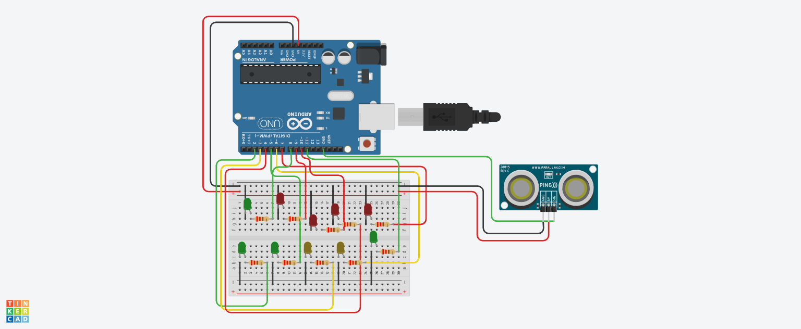

# Semáforo Inteligente com Sensor de Distância

Este projeto implementa um semáforo inteligente que utiliza um sensor de distância para detectar a presença de pedestres. 
Ao identificar que alguém se aproxima, o sistema interrompe automaticamente o tráfego dos veículos, acendendo as luzes do semáforo 
para pedestres, garantindo a segurança dos usuários.

# Estrutura do Código

O código é dividido em várias funções que 
gerenciam os sinais dos semáforos de carros e pedestres:
setup(): Inicializa os pinos dos LEDs e do sensor.
loop(): Monitora constantemente a distância e ativa os semáforos conforme necessário.
startCarSignals() / stopCarSignals(): Controla os sinais dos veículos.
startPedestrianSignals() / stopPedestrianSignals(): Controla os sinais para pedestres.

# Componentes

LEDs para sinais de trânsito
Sensor de distância (HC-SR04)
Microcontrolador (como Arduino)

